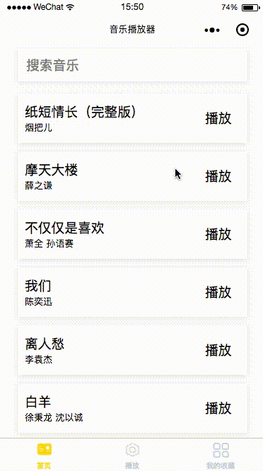

# WechatMusicPlayer
> 微信小程序：音乐播放器


### 预览

---




### 本地运行

---

首先下载小程序：

```
git clone https://github.com/shuiRong/WechatMusicPlayer.git
```

然后打开微信开发者工具—>新建小程序项目—>选择打开`WechatMusicPlayer/src`—>然后将AppID[^如何获取] 填成你自己的


**另外：** 项目后端需要[网易云API](https://github.com/Binaryify/NeteaseCloudMusicApi)支持，如何在本地运行请参考[文档](https://github.com/Binaryify/NeteaseCloudMusicApi)。运行完成后，将代码中所有的请求的host换成你本地的。比如：`localhost:3000`


#### TODO

---

* 利用API，网易云App大部分功能都可以实现


[^如何获取]: 注册并登录[微信公众平台](https://mp.weixin.qq.com) （账号类型选择小程序），然后在微信公众平台页面，找到左侧下方的设置—>开发设置—>AppID
